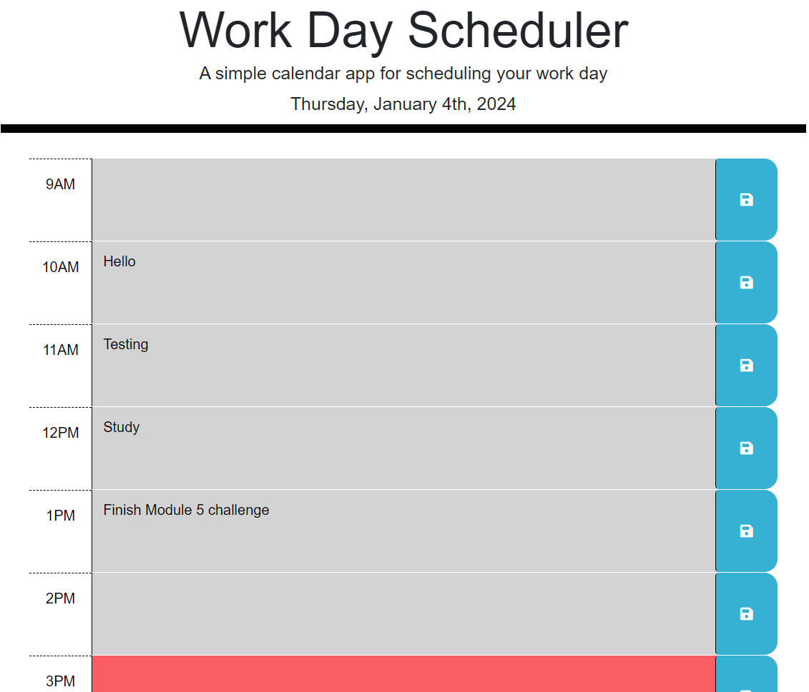

# work-day-scheduler
A simple calendar application that allows a user to save events for each hour of a typical working day (9am–5pm)
 

[Work Day Scheduler Website](https://kevinchogan.github.io/work-day-scheduler/)

## Description

An application for capturing meetings or tasks due for the current day.

## Installation

N/A

## Usage

- The web page automatically displays a 9 to 5 schedule for the current day
- Hour segments in the past are shown in grey
- The current hour segment is shown in red
- Hour segments in the future are shown in green
- Click on any hour segment to add a new meeting or task
- Click on the save icon to the right of the task to save that task to localStorage
- Click on the 'Clear' button at the bottom of the page to clear all storage

## Credits
- Font Awesome is copyright © Fonticons, Inc.
- Bootstrap licensed [MIT](https://github.com/twbs/bootstrap/blob/main/LICENSE), docs [CC BY 3.0](https://creativecommons.org/licenses/by/3.0/).
- Copyright © 2023 Day.js
- Fira Sans digitized data copyright 2012-2018: The Mozilla Foundation, Telefonica S.A., Carrois Corporate GbR and bBox Type GmbH.
- JQuery Copyright 2024 [OpenJS Foundation](https://openjsf.org/) and jQuery contributors. All rights reserved. 

## License

Please refer to the LICENSE in the repo.
